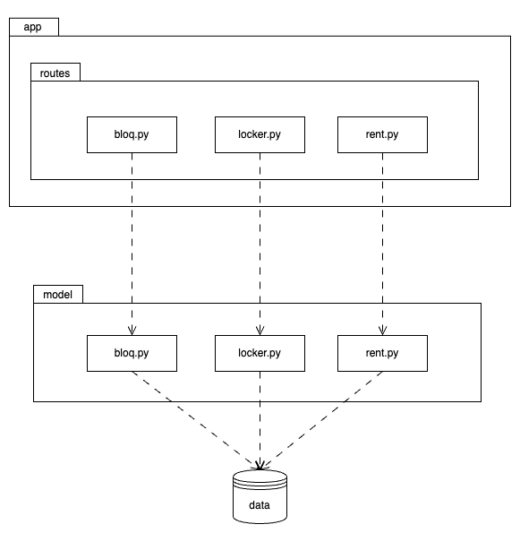

# REQUIREMENTS

The task is to implement an API that contains `Bloq`, `Locker`, and `Rent`
entities as resources. Data should be collected and stored in JSON files
located at [data](/data) folder.

## Concepts

__First Mile Delivery:__ beginning of the delivery journey, where goods are
collected from producers or manufacturers. For the purpose of this project,
it refers to initial transportation of goods, from source to first locker.

__Middle Mile Delivery:__ connects first and last mile delivery steps,
involving the transportation of goods over long distances, between distribution
centers. For the purpose of this project it refers to transportation of goods
between lockers.

__Last Mile Delivery:__ delivers goods to the end consumer. For the purpose
of this project it refers to the last pickup step.

## API

- Language: Python

- Main functionality:
  - `dropoff` parcels to a locker
    - cannot drop off on a closed locker
  - `pickup` parcels from a locker
    - cannot pick up from an open locker

- Extra functionalities
  - `create`, `get`, `update`, and `delete` bloq
  - `create`, `get`, `open`, `close`, and `delete` locker
  - `create`, `get`, and `delete` parcel

## Bloq

``` graphql
type Bloq {
  id: String
  title: String
  address: String
}
```

## Lockers / doors

``` graphql
enum LockerStatus {
  OPEN
  CLOSED
}

type Locker {
  id: String
  bloqId: String
  status: LockerStatus
  isOccupied: bool
}
```

### Constraints

Despite one locker can have multiple rents, only one of those rents status can
be not `DELIVERED` at the same time. This means, that when a rent starts its
journey, the locker assigned to it will be exclusive for it until de last pick
up action.

## Rent / parcel

Note: The entity-relationship diagram has `createdAt`, `droppedOffAt`,
and `pickedUpAt` information. However, that is not part of the `Rent`
properties, and it is also not part of the `rents.json` properties, so
I'll stick with the following:

``` graphql
enum RentStatus {
  CREATED
  WAITING_DROPOFF
  WAITING_PICKUP
  DELIVERED
}

enum RentSize {
  XS
  S
  M
  L
  XL
}

type Rent {
  id: String
  lockerId: string
  weight: number
  size: RentSize
  status: RentStatus
}
```

### Constraints
- When rent id `created` it does not have a locker assigned (`lockerId`
is null). All other parameters are assigned at this point.
- `lockerId` is assigned once `send` is triggered.

# Architecture


